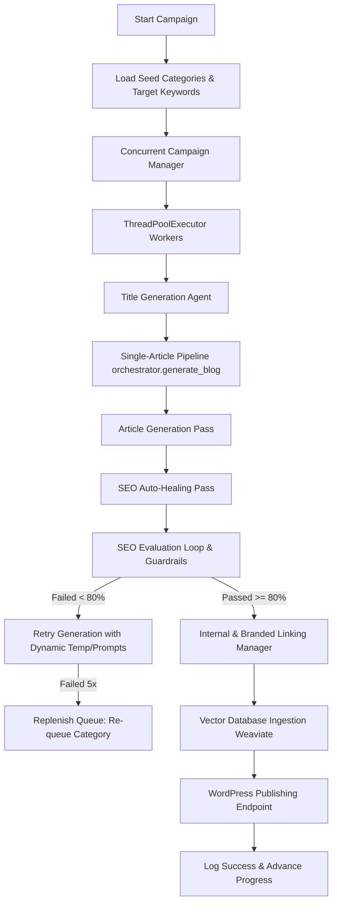

# End-to-End Blog Generation & Campaign Workflow

This document outlines the complete workflow of the AI Blog Generator from ingestion and category setup to concurrent article production and publication.

---

## 1. High-Level Process Architecture

---

## 2. Component Workflow Stages

### Stage A: Ingestion & Environment Configuration
- The system reads global configurations (`.env`), which define credentials, API keys, the target city (`TARGET_CITY=Rishikesh`), and the minimum pass score (`SEO_THRESHOLD=80`).
- Sitemap mappings, duplicate checking logs, and scraped titles are parsed to seed the initial keyword extraction and generation parameters.

### Stage B: Concurrent Campaign Orchestration
- `ConcurrentCampaignManager` starts a multi-threaded execution queue based on a configured pool size (`max_workers=6`).
- It cycles through the configured tourism categories to guarantee high-intent distribution (e.g., *River Rafting*, *Best Hotels*, *Solo Travel*).
- **Keyword Protection**: Prior to sending keywords to the generator, the orchestrator sanitizes city keywords and handles ampersands (`&` -> `and`) to prevent repetitive nonsense phrases such as `"best hotels in rishikesh in rishikesh"`.

### Stage C: Single-Article Generation, Auto-Healing & SEO Guardrails
- **Pass 0 (Smart Quota Control & Smoother)**: Every outgoing call to the Google GenAI SDK (for titles, content, evaluation, image generation, and social exporting) is intercepted by a thread-safe **TokenBucketLimiter**. If parallel workers exceed rate limits (e.g. 15 RPM for Flash, 2 RPM for Pro models, or 5 RPM for Imagen), the limiter safely blocks (sleeps) the thread, smoothing request bursts.
- **Pass 1 (Resilient Generation)**: The generator draft is written via a call to `call_llm`. If transient quota exhaustion occurs, the call is retried up to 5 times using an exponential backoff loop with randomized jitter (`2^retry + jitter`) to recover smoothly.
- **Pass 2 (SEO Auto-Healing)**: The generated draft is programmatically modified by the `SEOAutoHealer` to guarantee strict alignment with meta tags, target city keyword counts (3-10), exact location boosters, scannable heading structures (H1/H2/H3), paragraph counts, bold/strong formatting, bullet lists, FAQ counts, and default internal links. This ensures high scores on the very first try without relaxing quality guardrails.
- **Pass 3 (Feedback Loop)**: The drafts are ran through 8 metrics in the SEO Evaluator (Title Optimization, Keyword Integration, Word Count, Heading Structure, etc.).
- **Pass 4 (Dynamic Retries & Backoffs)**: If an article scores below `80/100` (which is rare after healing), the orchestrator provides structural feedback and retries with a modified temperature.
- **Pass 5 (Automatic Replenishment)**: If an article fails all iterations, the concurrent manager handles the rejection seamlessly by calculating next category rotations and appending a new replacement task to the executor.

### Stage D: Linking & Publishing
- Branded links, anchors, and deep-research references are dynamically interwoven.
- The finalized markdown is posted to WordPress via REST APIs, Blogger via Blogger API, and Tumblr via `TumblrPublisher` (rotating dynamically across all discovered Tumblr accounts in a round-robin format), and ingested into Weaviate for semantic analysis.
- **Deferred Stats Tracking**: For LinkedIn and Medium campaigns, database updates and `stats.json` increments are deferred until successful email dispatch (remote SMTP send or local fallback save) to ensure stats accuracy.

